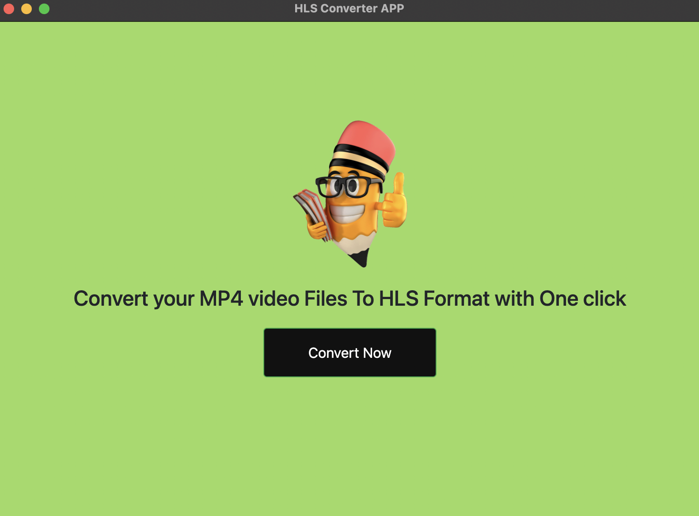

# Video__Convert
## Electron App which convert the input (.mp4) video to HLS (HTTP Live Streaming Video Format) 

### Application Preview

#### 1. Click and select the video

#### 2. Select (.mp4) files to convert them, you are not allowed to select files of other format

#### 3. You can preview the converted files in the converter itself

#### 4. Will receive notifications regarding the status of video conversion

